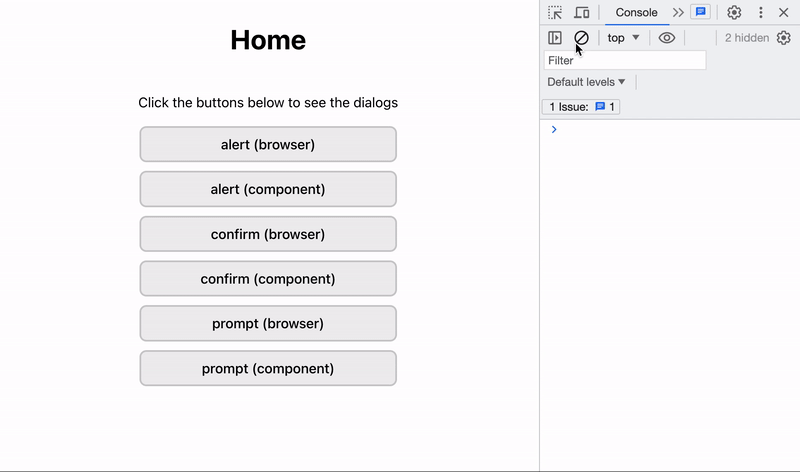

# React 컴포넌트로 Dialog 만들기

브라우저 지원 함수인 `alert`, `confirm`, `prompt`를 직접 구현해 본 프로젝트 입니다.

## 실행 방법

본 프로젝트를 클론 받은 뒤 터미널에서 아래 명령어를 실행합니다.

```shell
yarn && yarn dev
```

## 미리보기



## 구현 과정

구현 과정에 대한 내용은 [블로그](https://velog.io/@foreknowledge/React-%EC%BB%B4%ED%8F%AC%EB%84%8C%ED%8A%B8%EB%A1%9C-alert-confirm-prompt-%EA%B5%AC%ED%98%84%ED%95%98%EA%B8%B0)에서 확인하실 수 있습니다.
